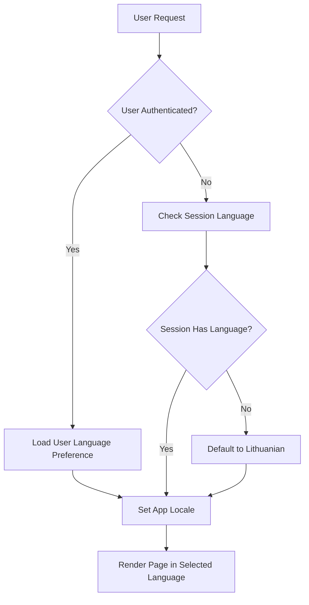

# Internationalization (i18n) Guide

## Overview

The Propaganda Analysis System supports multiple languages, currently Lithuanian (lt) and English (en). The system uses Laravel's built-in localization features to provide a seamless multilingual experience.

## Supported Languages

- **Lithuanian (lt)** - Default language
- **English (en)** - Full translation available

## Architecture

### Language Files

Translation files are located in `resources/lang/`:
```
resources/lang/
├── en/
│   └── messages.php    # English translations
└── lt/
    └── messages.php    # Lithuanian translations
```

### Language Switching

Users can switch languages using:
1. **Authenticated users**: Language preference is stored in the database (`users.language` column)
2. **Unauthenticated users**: Language preference is stored in session

The language switcher is available in the top navigation bar on all pages.

### Middleware

The `SetLanguage` middleware (`app/Http/Middleware/SetLanguage.php`) handles language detection:
1. Checks authenticated user's language preference
2. Falls back to session language for guests
3. Defaults to Lithuanian if no preference is set

## Adding New Translations

### 1. Add Translation Keys

Edit the appropriate language file:

```php
// resources/lang/en/messages.php
return [
    'new_feature' => 'New Feature',
    'description' => 'Feature description',
];

// resources/lang/lt/messages.php
return [
    'new_feature' => 'Nauja funkcija',
    'description' => 'Funkcijos aprašymas',
];
```

### 2. Use in Blade Templates

```blade
{{-- Use translation helper --}}
<h1>{{ __('messages.new_feature') }}</h1>

{{-- Use with parameters --}}
<p>{{ __('messages.welcome_user', ['name' => $user->name]) }}</p>

{{-- Use in attributes --}}
<input placeholder="{{ __('messages.search') }}">
```

### 3. Use in PHP Code

```php
// In controllers or services
$message = __('messages.success_message');

// With parameters
$greeting = __('messages.hello_user', ['name' => $userName]);
```

## Translation Coverage

All user-facing interfaces are fully translated:

### Core Pages
- ✅ Dashboard
- ✅ Analysis creation form
- ✅ Analysis list
- ✅ Analysis results
- ✅ Settings
- ✅ Help pages
- ✅ Mission Control
- ✅ Contact page
- ✅ Legal information page

### Components
- ✅ Navigation menu
- ✅ Form labels and placeholders
- ✅ Validation messages
- ✅ Success/error notifications
- ✅ DataTable UI elements
- ✅ Chart labels

### Dynamic Content
- ✅ Status messages
- ✅ Error messages
- ✅ Tooltips and help text
- ✅ Modal dialogs

## Language Detection Flow



## Best Practices

### 1. Always Use Translation Keys
Never hardcode text in views:
```blade
{{-- Bad --}}
<h1>Propaganda Analysis</h1>

{{-- Good --}}
<h1>{{ __('messages.title') }}</h1>
```

### 2. Group Related Translations
Organize translations logically:
```php
// Navigation
'home' => 'Home',
'dashboard' => 'Dashboard',
'analyses' => 'Analyses',

// Forms
'submit' => 'Submit',
'cancel' => 'Cancel',
'save' => 'Save',
```

### 3. Handle Pluralization
Use Laravel's pluralization features:
```php
'analyses_count' => '{0} No analyses|{1} :count analysis|[2,*] :count analyses',
```

### 4. Escape HTML in Translations
For translations containing HTML, use `{!! !!}`:
```blade
{{-- If translation contains HTML --}}
<p>{!! __('messages.legal_html_content') !!}</p>
```

## Testing Translations

### Manual Testing
1. Switch language using the language selector
2. Verify all UI elements display in the selected language
3. Check form validation messages
4. Test dynamic content (AJAX responses, modals)

### Automated Testing
See `tests/Feature/LanguageSwitchingTest.php` for examples:
```php
public function test_page_displays_correct_language()
{
    $user = User::factory()->create(['language' => 'en']);
    $this->actingAs($user);
    
    $response = $this->get('/dashboard');
    
    $response->assertSee('Dashboard');
    $response->assertDontSee('Skydelis');
}
```

## Adding a New Language

To add support for a new language:

1. Create language directory:
   ```bash
   mkdir resources/lang/de
   ```

2. Copy English translations as a starting point:
   ```bash
   cp resources/lang/en/messages.php resources/lang/de/messages.php
   ```

3. Translate all keys in the new file

4. Update language switcher in `layout.blade.php` to include new language option

5. Test thoroughly with the new language

## Common Issues

### Missing Translations
If a translation key is missing, Laravel will display the key itself:
- Display: `messages.missing_key`
- Solution: Add the missing key to all language files

### Cache Issues
After adding new translations:
```bash
php artisan cache:clear
php artisan config:clear
php artisan view:clear
```

### Character Encoding
Ensure all language files are saved in UTF-8 encoding to properly display special characters.

## Language-Specific Considerations

### Lithuanian
- Uses UTF-8 characters (ą, č, ę, ė, į, š, ų, ū, ž)
- Longer text may require UI adjustments
- Date format: YYYY-MM-DD

### English
- Generally shorter text
- Date format: MM/DD/YYYY or DD/MM/YYYY depending on locale

## Future Enhancements

Potential improvements to the internationalization system:
- [ ] Add more languages (Russian, Polish, German)
- [ ] Implement automatic language detection based on browser settings
- [ ] Add translation management UI for administrators
- [ ] Support for RTL languages
- [ ] Localized number and date formatting